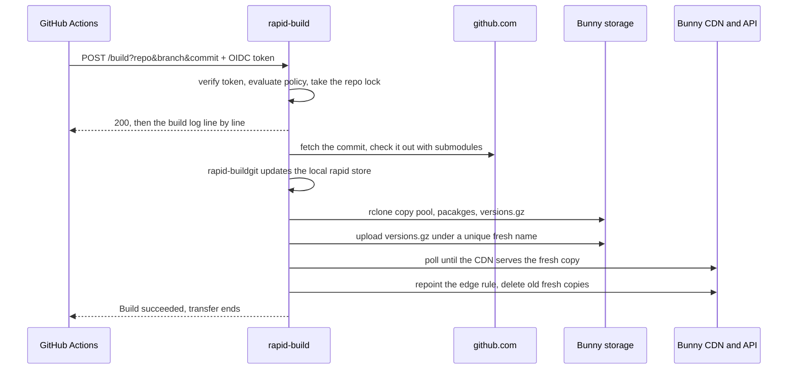

# rapid-builder

HTTP service that builds [rapid](https://springrts.com/wiki/Rapid) packages from
any commit of a GitHub repository and publishes them to Bunny storage. GitHub
Actions triggers a build and authenticates with the workflow's OIDC token, so
there are no shared secrets on the GitHub side.

## How a build runs



Builds of one repo are serialized, and the git checkout and the rapid store
persist, so each build only does the work that changed.

The last three steps work around Bunny storage replication lag, see
`refreshVersionsEdgeRule` in [src/bunny.ts](src/bunny.ts).

## Documentation

- [The local sandbox](docs/sandbox.md): running the whole thing on your machine
  against local fakes, with no GitHub repository and no Bunny account.
- [Build API](docs/api.md): request parameters, the streamed response and its
  outcomes.
- [Authorization](docs/authorization.md): the CEL policy each repo declares.
- [Configuration](docs/configuration.md): `config.json` and the environment,
  and where each of them is declared.
- [Deployment](docs/deployment.md): running the container, and what a reverse
  proxy in front of it must do.

Prometheus metrics are served on a separate port (see
[src/metrics.ts](src/metrics.ts)). Logs are generated as one JSON log line per
event, and go to stdout (see [src/log.ts](src/log.ts)).

## Development

```sh
npm ci
npm run check     # biome, tsc and the unit suites
npm run lint:fix  # writes the fixes biome can make
npm test          # unit suites
npm run test:e2e  # builds the e2e image and runs the pipeline for real
```

To see a change working, run the service on your own machine:

```sh
dev/seed-origin.sh        # a small game repository in ./origin
docker compose up --build
```

Compose keeps running and prints the logs, so trigger the build build from
another terminal:

```sh
curl -N -X POST -H "authorization: Bearer $(node dev/token.ts)" \
  "http://127.0.0.1:8080/build?repo=testrepo&branch=test&commit=$(git -C origin rev-parse HEAD)"
```

Then commit to `./origin` and ask again, and read `./sandbox/bunny/` to see
what changed.

Bunny and the OIDC issuer are local fakes, so that needs no network and no
credentials. See [the local sandbox](docs/sandbox.md) documentation.

To run the same compose file against a real Bunny account, see
[against a real Bunny account](docs/sandbox.md#against-a-real-bunny-account).
